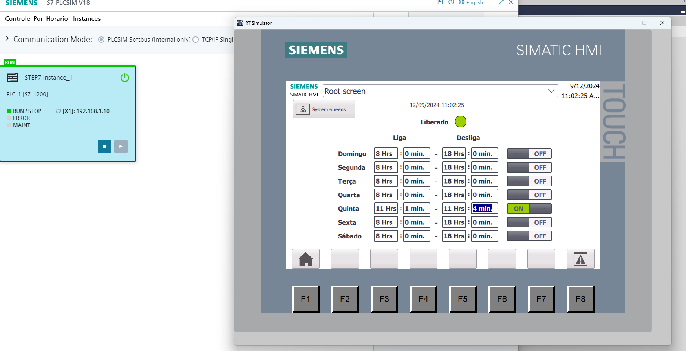
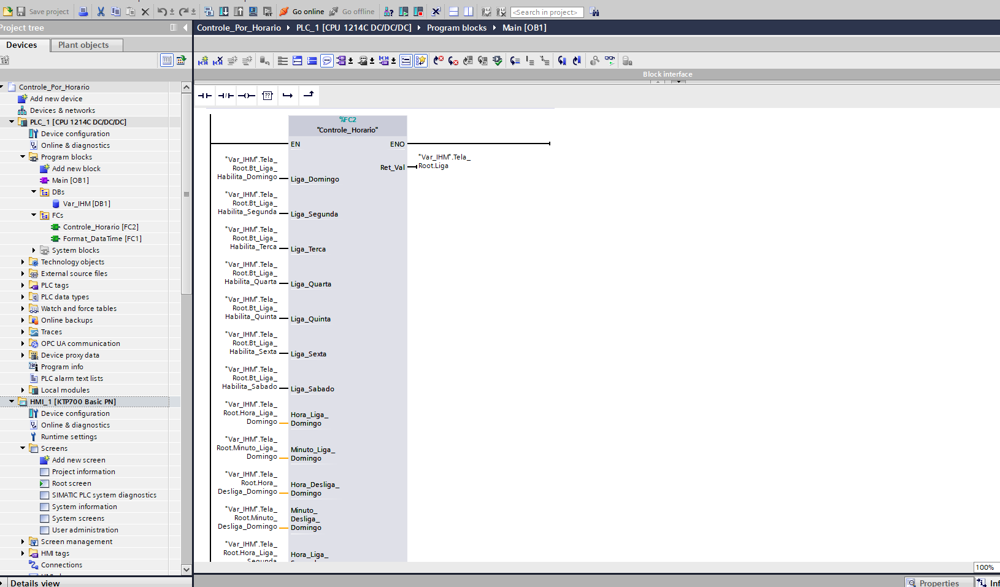
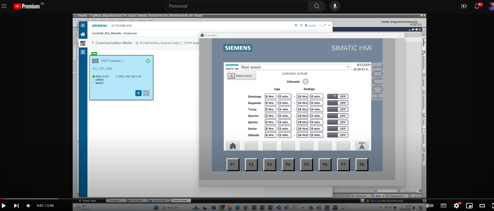

# Controle por dia da Semana

O objetivo deste projeto exemplo é apresentar uma FC que criei realizar um controle de acionamento agendado por horário e dia da semana.

<!-- Inserir imagem com a #vitrinedev ao final do link -->

Elaborado por Ezequiel da Silva Daniel

[Blog](https://ezequieldaniel.wordpress.com/)  
[Email](ezequielsd@gmail.com)

  

## Apresentação

Se você precisa realizar o acionamento e desacionamento agendado por hora e dia da semana, então essa FC é para você. Basta ativar o dia que deseja que seja acionado e informar a hora e minuto para ligar e hora e minuto para desligar e pronto.

## Requisitos

O projeto foi desenvolvido no TIA PORTAL V18.

## Como utilizar

Basta incorporar a FC localizada na pasta FCs ao seu projeto, podendo ser arrastado para outro TIA aberto, ou usando esse projeto como base para desenvolver o seu.
Deve ser informando de forma separado as horas e os minutos. No projeto poderá ser visualizado como adicionar na IHM, na tela **Root Screem**.
A FC pega automaticamente o relógio da CPU, não é necessário adicionar um bloco de **RD_LOC_T**.
O bloco possui:

**IN**

* Liga_(dia da semana) : Para habilitar o funcionamento no dia da semana desejado, no tipo Bool.
* Hora_Ligar / Hora_Desligar: Hora para ligar e hora para desligar, no tipo USINT.
* Minuto_Ligar / Minuto_Desligar: Minuto para ligar e minuto para desligar, no tipo USINT.

**OUT**

* Ret_Val: Saida de comando, no tipo Bool.

<!-- Inserir imagem com a #vitrinedev ao final do link -->

<!-- Inserir imagem com a #vitrinedev ao final do link -->

## Pacotes de terceiro

N.A.

## Autor

Ezequiel da Silva Daniel  

## Licença

[MIT]

## Release

A versão Release do programa. Se preferir pode pegar na pasta "Aquivado" o programa no formato compactado do TIA, em tamanho menor.

